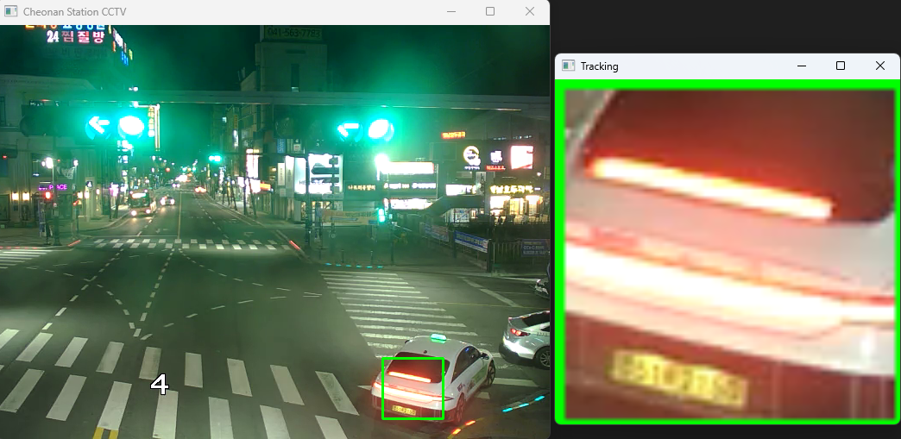
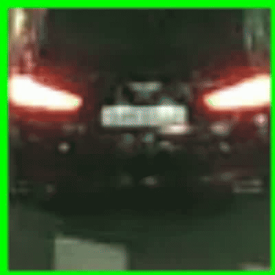

# CarTrackRecorder

## 프로그램 설명
이 프로그램은 **CCTV 영상 스트림**을 이용하여 자동차를 추적하고 녹화하는 기능을 제공합니다.
사용자는 마우스로 자동차를 선택하면 **MeanShift 알고리즘**을 사용하여 자동차를 추적하며,
녹화 기능을 활성화하면 전체 영상과 자동차 확대 영상을 저장할 수 있습니다.

## 주요 기능
- **CCTV 영상 스트림 입력 (RTMP, RTSP 지원)**
- **자동차 선택 및 추적 (MeanShift 알고리즘 적용)**
- **자동차 확대 영상 출력**
- **영상 녹화 기능 (전체 화면 + 자동차 확대 화면 저장)**
- **녹화 상태 표시 (화면 좌측 상단 빨간 원 표시)**

## 실행 사진 및 영상
 

 
 
